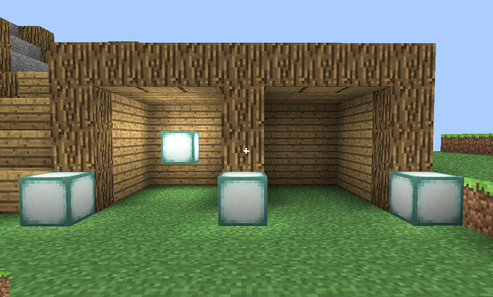

# my craft

## 简介
&emsp;&emsp;这是我大三上学期的计算机图形学作业，用c++山寨了一个minecraft。起初这个项目是用webgl写的，但是运行太慢了遂移植到了opengl。然后再加了一小点功能便有了现在这个模样。

&emsp;&emsp;因为不是什么正经项目，所以代码规范之类的就没我其他项目那么好了。然后……没课了所以这个项目停止更新。就作为我作业的一个存档留在github吧。~~作业已在去年上交~~

&emsp;&emsp;编译完成的版本已经发布在release中。

## 编译

&emsp;&emsp;本作业使用 CMake 进行跨平台编译

&emsp;&emsp;对于Linux，请准备以下环境
- gcc
- cmake
- libgl

&emsp;&emsp;对于Windows，请准备以下环境
- mingw 编译器
- cmake
- Unix bash 环境

&emsp;&emsp;运行以下指令

```shell
mkdir build
cd build
cmake ..
make
```

&emsp;&emsp;build 目录下会生成可执行文件，**编译后，请将 src/shader 文件夹， texture文件夹和可执行文件放置于同一目录底下，并且在可执行文件所在目录建立 saves 文件夹。**

&emsp;&emsp;GUI模式编译请参考各平台CMake操作说明。

## 操作

WSAD: 前进，后退，向左，向右

空格： 跳跃

C：切换长焦镜头

R：返回出生点

ESC：释放鼠标

F1：是否显示十字准心和手持方块（隐藏后便于截图）

鼠标滑动：控制镜头朝向

鼠标左键：破坏方块

鼠标右键：放置方块

鼠标滚轮：切换在手上的方块

## 游戏内截图




